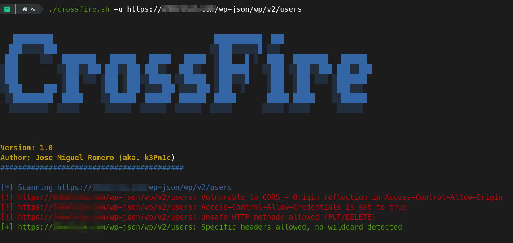

# Crossfire 🔍

## Descripción General

Crossfire es una herramienta de seguridad basada en Bash diseñada para escanear sitios web en busca de configuraciones incorrectas de Cross-Origin Resource Sharing (CORS). Este script ayuda a investigadores de seguridad y desarrolladores a identificar posibles vulnerabilidades de CORS que podrían exponer aplicaciones web a ataques de cross-site scripting (XSS) y otros ataques basados en web.

## Características

- 🌐 Escaneo de URLs únicas o múltiples
- 🚨 Detección de configuraciones incorrectas de CORS
- 🔬 Verificaciones de:
  - Vulnerabilidades de origen con comodín
  - Métodos HTTP inseguros
  - Cabeceras demasiado permisivas
- 🎨 Salida de consola colorida y fácil de leer
- 📄 Opción de guardar resultados en archivo
- 🚀 Soporte de escaneo en paralelo

## Requisitos Previos

- Bash
- curl
- xargs

## Instalación

1. Clonar el repositorio:
   ```bash
   git clone https://github.com/k3Pn1c/crossfire.git
   cd crossfire
   ```

2. Hacer el script ejecutable:
   ```bash
   chmod +x crossfire.sh
   ```

## Uso

### Escaneo Básico

Escanear una URL única:
```bash
./crossfire.sh -u https://ejemplo.com
```

Escanear múltiples URLs desde un archivo:
```bash
./crossfire.sh -w urls.txt
```

### Opciones Avanzadas

- `-h`: Mostrar menú de ayuda
- `-u <url>`: Escanear una URL única
- `-w <archivo>`: Escanear múltiples URLs desde un archivo
- `-o <origen>`: Establecer un origen personalizado (por defecto: https://evil.com)
- `-t <hilos>`: Establecer hilos concurrentes (por defecto: 10)
- `-s <archivo>`: Guardar resultados en un archivo

### Ejemplos




Escanear con origen y hilos personalizados:
```bash
./crossfire.sh -u https://ejemplo.com -o https://atacante.com -t 5
```

Escanear URLs y guardar resultados:
```bash
./crossfire.sh -w urls.txt -s resultados_cors.txt
```

## Salida

El script proporciona una salida coloreada:
- 🟢 Verde: No se detectan vulnerabilidades significativas
- 🟥 Rojo: Vulnerabilidades potenciales de CORS detectadas
- 🟨 Amarillo: Mensajes informativos

## Contribución

1. Haz un fork del repositorio
2. Crea tu rama de características (`git checkout -b caracteristica/CaracteristicaAsombrosa`)
3. Confirma tus cambios (`git commit -m 'Añadir CaracteristicaAsombrosa'`)
4. Sube a la rama (`git push origin caracteristica/CaracteristicaAsombrosa`)
5. Abre un Pull Request

## Autor

👤Jose Miguel Romero (aka. k3Pn1c) - Versión inicial 1.0

## Descargo de Responsabilidad

🚨 **Utiliza esta herramienta de manera responsable y solo en sitios web para los que tengas permiso de prueba.**
